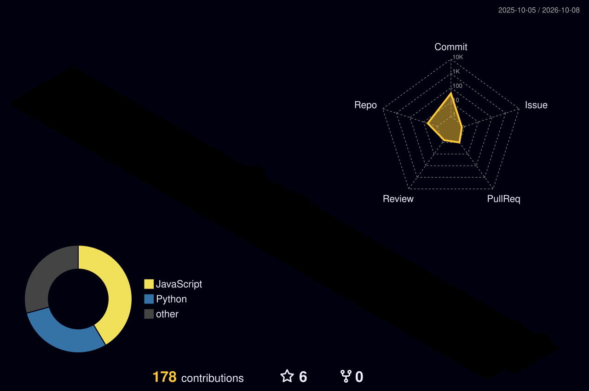

<!-- ═══════════════ HEADER ═══════════════ -->


<div align="center">

<a href="https://github.com/rootphantom">
  
</a>

<br/>


</div>

---

## 👾 About Me

<div align="center">

```js
const rootphantom = {
  role: "Full Stack Developer",
  education: "B.Tech in Computer Science & Engineering",
  location: "India 🇮🇳",
  currentlyLearning: ["System Design", "DevOps", "Cloud", "DSA"],
  currentlyBuilding: "Something awesome 🚀",
  funFact: "I debug with console.log() and I'm not ashamed.",
  lookingFor: "Internships, open-source projects & collabs"
};
```

</div>

---

## 🛠️ Tech Stack

<div align="center">

**Languages**

<br/>

**Frontend**

<br/>

**Backend & Databases**

<br/>

**Tools & DevOps**


</div>

---

## 📊 GitHub Stats

<div align="center">


<br/>


</div>

---

## 🧊 3D Contribution Graph

<div align="center">

<!-- Generated automatically by .github/workflows/profile-3d.yml -->


</div>

---

## 🐍 Contribution Snake

<div align="center">

<!-- Generated automatically by .github/workflows/snake.yml -->


</div>

---

## 🏆 Achievements

<div align="center">


</div>

---

## 📌 Featured Projects

<div align="center">

<!-- Replace "repo-name" with your actual repositories -->
<a href="https://github.com/rootphantom/repo-name">
  
</a>
<a href="https://github.com/rootphantom/repo-name-2">
  
</a>

</div>

---

## 🤝 Let's Connect

<div align="center">

<a href="https://linkedin.com/in/anurag-singh0041"></a>
<a href="mailto:your-email@example.com"></a>

<br/><br/>


</div>

<!-- ═══════════════ FOOTER ═══════════════ -->

